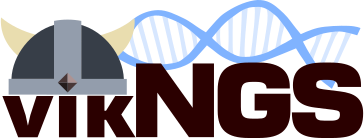

For quick information on how to use VikNGS, see :ref:`Quick Start <quick_start>`.

Documentation for VikNGS
==================================

The Variant Integration Kit for Next Generation Sequencing (VikNGS) was designed for association analysis of NGS data integrated across different studies. Compared to the usual score test, it uses a score test with a robust variance calculated from the expected genotype probability given the observed sequencing data, rather than the hard genotype call.

The software package includes tests for both rare and common variant association and can handle both case-control and quantitative studies.

Provide a multisample VCF file and a tab-separated sample information file. The variants will be extracted from the VCF and expected genotypes are computed for every individual. Variants are then filtered based on user-provided filtering parameters. A series of association tests are performed and the resulting p-values are provided as output.

The code is `freely available on GitHub <https://github.com/ScottMastro/VikNGS>`_ 

.. toctree::
   :maxdepth: 2
   :caption: Table of Contents

   quick_start
   source_code
   input
   parameters
   tests
   output
   power_calculation

