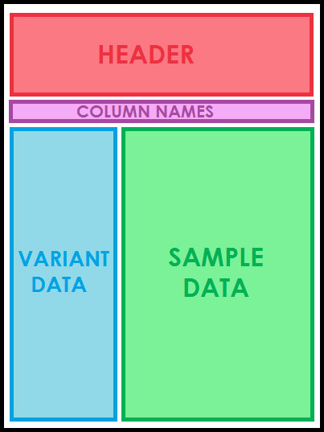

.. _input:

Input Files
==================================

Quick Summary
---------------

VikNGS takes 3 different file types as input:

- a multi=sample VCF that provides genotype information
   - genotype information is extracted from **GL** (preferred), **PL**, and **GT** fields
- a tab-separated sample information text file containing phenotype and covariate information
   - must be created by user ref:`see column details code<sample_info>` for what this file should contain
- a BED file to specify the variant collapsing strategy (optional)
   - genes and exons specified in the file can be used to define regions to collapse upon
   - can be generated automatically from the `UCSC Table Browser <http://genome.ucsc.edu/cgi-bin/hgTables>`_

Below, the different types of files are explained in further detail.-

.. _multisample_vcf:

Multi-sample VCF
---------------

A Variant Call Format (VCF) file is a standard way of storing variant information called from sequencing data. Each row of a VCF file corresponds to a genetic variant (insertion, deletion or substitution) and contains information such as the genomic position of the variant, the confidence in the variant call and many other additional annotations.

A multi-sample VCF is formatted identically to a single-sample VCF except it contains an extra set of columns corresponding to sample-specific data.

   The general layout of a multi-sample VCF file.

The first set of lines in a VCF file make up the header and are denoted by the characters *##*. The header includes information about the data source and how the VCF file was constructed. This information is ignored when by VikNGS. The last line of the header is denoted with a single *#* and includes the column names in addition to a unique identifier for every sample. The first nine columns must be (tab-delimited, in order) **CHROM**, **POS**, **ID**, **REF**, **ALT**, **QUAL**, **FILTER**, **INFO** and **FORMAT**. Every subsequent value is expected to be a unique sample identifier.

.. code-block:: python
   :caption: *Example of a multi-sample VCF*

    ##fileformat=VCFv4.1
    ##FILTER=<ID=PASS,Description="All filters passed">
    ##FORMAT=<ID=GT,Number=1,Type=String,Description="Genotype">
    ##FORMAT=<ID=GL,Number=.,Type=Integer,Description="Genotype Likelihood">
    ##FORMAT=<ID=PL,Number=G,Type=Integer,Description="Normalized, Phred-scaled likelihoods">
    #CHROM	POS	ID	REF	ALT	QUAL	FILTER	INFO	FORMAT	SAMPLE_1_ID	SAMPLE_2_ID	...
      22	160036	snp_1	A	C	.	PASS	.	GT:PL:GL	0/0:0,15,73:.	1/1:50,8,0:-5,-0.84,-0.07
      22	160408	snp_2	T	C	.	PASS	.	GT:PL	./.:.	0/0:0,36,248
      22	160612	snp_2	C	G	.	PASS	.	GT:GL	0/1:-0.48,-0.48,-0.48	1/1::-4.4,-0.27,-0.33

.. note::
 While parsing the file only SNPs will be retained (a single A, T, C, or G in both the REF and ALT columns). Multiallelic sites are also currently ignored by VikNGS.

Variant Specific Columns
~~~~~~~~~~~~~~~~~~~~~~~~

The first nine columns contain information relevant to the called variants.

The first two required columns (**CHROM**, **POS**) specify the genomic coordinates of the variant. The first base pair of a chromosome is denoted as position 1. **CHROM** is treated as a unique identifier for a chromosome. **POS** is expected to be a positive integer value.

The third column (**ID**) assigns an identifier to each variant.

The forth and fifth columns (**REF**, **ALT**) refer to reference alleles derived from a reference genome and alternative alleles observed in the sequencing data. These columns specify whether the variant is an indel or a SNP. 

The sixth column (**QUAL**) provides a Phred-scaled probability that the called base is correct. This field is ignored and not used by vikNGS.

The seventh column (**FILTER**) Indicates whether or not the variant has passed all of the quality control checks present in the variant calling pipeline that produced the VCF file. The value of this field will be **PASS** if the variant passed all of the filters and will be “.” if no checks were applied.

The eighth column (**INFO**) contains additional variant annotations, delimited by a semicolon. This field is ignored and not used by vikNGS.

The ninth column (**FORMAT**) specifies the ordering of sample-level annotations, delimited by a colon. All subsequent sample-specific columns will provide values for each annotation, placed in the same order and also delimited by a colon. In particular, the ordering of **GT**, **GL**, and **PL** is extracted from this column.

Sample Specific Columns
~~~~~~~~~~~~~~~~~~~~~~~~

All columns following the **FORMAT** column should correspond to a single sample. The header of each column specifies a unique identifier for each sample. Values in subsequent columns are colon separated and are ordered with respect to the labels in the **FORMAT** column. The following values are extracted for each sample.

**GT** (Genotype): A pair of values specifying the predicted genotype for a specific sample (0/0 homozygous reference, 0/1 heterozygous, 1/1 homozygous alternative).

**GL** (Genotype likelihood): A set of three numbers indicating the log-scaled genotype probability of all three possible genotypes. Each number corresponds to the value for homozygous reference, heterozygous, and homozygous alternative, respectively.

**PL** (Phred-scaled likelihood): A set of three integers indicating the Phred-scaled probability of all three possible genotypes (homozygous reference, heterozygous, and homozygous alternative). These values are normalized since all the values are relative to the most likely genotype (and are therefore not probabilities).

.. note::
    **GL** and **PL** are both ways of representing genotype probabilities. Both values can be used to derive genotype probabilities but because **PL** is a rounded integer, **GL** is more accurate.

    :math:`genotype\_probability=10^{\textbf{GL}}=10^{-\textbf{PL}/10}`

    :math:`-10\textbf{GL}=\textbf{PL}`

When running an association test in VikNGS, different genotype values can potentially be used. If the "Use VCF GT" option is checked, VikNGS will extract the **GT** value only and convert the value to a genotype {0, 1, 2}. If "Use Expected GT" is checked, the software will attempt to parse the **GL** values from each sample first. If **GL** values are missing or are formatted incorrectly, then the **PL** values will be extracted. If parsing of both **GL** and **PL** values fail, the **GT** values will be extracted. An expected genotype value [0,2] will be calculated from the extracted column. If "Use GT calls" is chosen, genotype probabilities will be extracted in the same way the expected gentype method but a hard genotype call {0, 1, 2} will be made instead of calculating the expected value. 

 If the relevant information is not present for a given variant, that variant will be skipped and not included in analysis.

.. note::
    Note that if **GT** values are indicated as “missing” (ex. ./.) then the variant will be skipped even if values for **GL** and **PL** are present.

.. _sample_info:

Sample Information File
-----------------------

To utilize phenotypic data and sample-specific information, vikNGS requires the user to provide this information in a separate file. This tab-separated file is defined specifically for use in vikNGS. This file should *not* have headers and is expected to contain one sample per line.
    
The columns are defined as follows:

Sample ID
~~~~~~~~~
Every line in the sample information file should begin with a *unique* sample ID. The only additional requirement is that every sample ID needs to identically match exactly one of the IDs that appear after the **FORMAT** column in the multisample VCF file. This column specifies the relationship between the sample-specific data and the data in the VCF file.

Phenotype
~~~~~~~~~~~~~~~~~
This column contains phenotypic data which will be used to identify association with genotype information.

.. note:: 
    If looking to find association information between case-control groups, this column is used to specify case-control status. Please designate cases with a 1 and controls with a 0 in this column.

Group ID
~~~~~~~~
Use this column to specify if samples are from different groups or studies. Any samples with the same value in the column will be put in the same group.

Read Depth
~~~~~~~~~~
If using the expected genotype method, the score test calculates the variance for each group separately and needs to be aware of which groups are high read depth versus low read depth. The read depth of each sample must be specified in this column. The numerical read depth value (ex. 32) can be provided for each sample or simply a letter specifying whether a sample is from a high or low sequencing run (H = high, L = low). Note that all samples with a shared group ID must also share high/low read depth status. Therefore, the first read depth value encountered for a group will be applied to all members of that group.

Covariates
~~~~~~~~~~
The remaining columns are used to specify covariates. Covariates can either be continuous or categorical. If every value in a covariate column is numeric, the column will be treated as a continuous covariate. If a single non-numeric value is identified, the covariate will be treated as categorical and a new dummy covariate will be made for EVERY unique value (high cardinality categorical variables can result in significantly longer computation time).

.. _bed_file:

BED File (Optional)
-----------------------

Elucidation of associated rare variants can be challenging because the frequency of the associated allele can be extremely low. To improve the power of statistical tests that identify rare alleles, it is necessary to collapse a group of linked variants and perform the association test on a genetic region rather than individual SNPs. For rare variant association in vikiNGS, a collapsing strategy must be specified.

There are three types of collapsing strategies available:
- Collapse every \\(k\\)
- Collapse by gene
- Collapse by exon

By default, the variants will be read and filtered from an input VCF file. After the filtering step, the first \\(k\\)th variants will be collapsed together, followed by the next set of \\(k\\) non-overlapping variants and so on (\\(k=5\\) by default).

To collapse variants in a more biologically relevant way, a BED file must be provided specifying the collapsible regions. A BED file is a tab-delimited table which describes genomic features intended to be used for visualization in a genome browser. The format is specified by UCSC Genome Bioinformatics, detailed information can be found on their `web page <https://genome.ucsc.edu/FAQ/FAQformat.html>`_ web page. Every line describes a single region as follows

The first three columns specify the gene 

1. **chrom** - The name of the chromosome matching the first column in the VCF file.
2. **chromStart** - The starting position of the gene on the chromosome (starting from 0)
3. **chromEnd** - The ending position of the gene on the chromosome. This base is not included in the gene.

For example, to specify the first 250 bases on chromosome 4:
chr4    0    250

The next six column are specified by the BED format but are not used in variant collapsing:

4. **name** - Optional identifier for this region.
5. **score** -  Not used.
6. **strand** - Not used.
7. **thickStart** - Not used.
8. **thickEnd** - Not used.
9. **itemRgb** - Not used.

The last three columns are potentially used if collapsing:

10. **blockCount** - The number of blocks (exons) in the gene.
11. **blockSizes** - The size of each exon, comma separated list the size of blockCount.
12. **blockStarts** - Positions where each exon should begin, relative to chromStart. Comma separated list the size of blockCount

To collapse variants by gene, the first three columns are required to indicate where each gene begins and ends.

To collapse variants by exon, all twelve columns must be present. The coding region is defined to be where the first block/exon starts to where the last one ends. Each exon is specified by a block and variants within that block will be collapsed.

.. warning:: Genes and exons can be very large and could contain thousands of variants to collapse in a single test. This can cause large computational burden, especially if a permutation test is used to calculate the p-value. Therefore, a maximum collapse size can be specified. Variants will be collapsed into a single test until the maximum size is reached and subsequent variants will be put into a new collapsed set.

